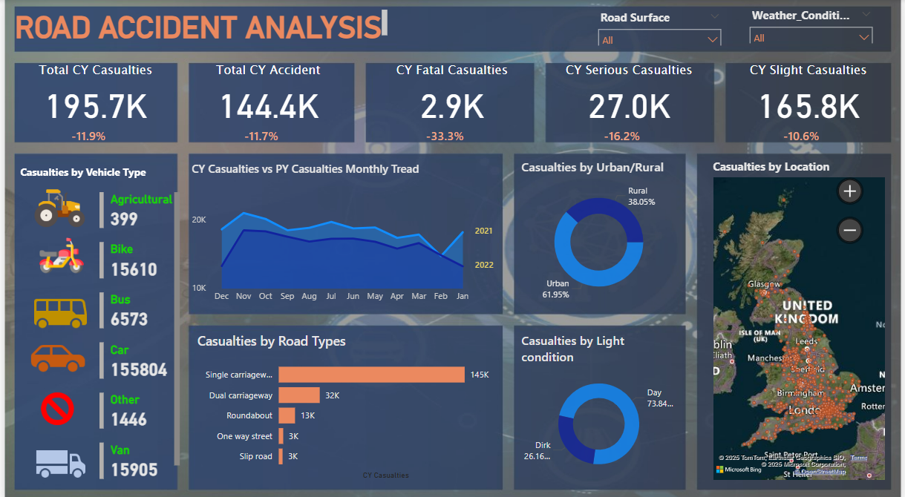

# 🚗 Road Accident Analysis Dashboard (Power BI)

## 📌 Problem Statement

Road accidents are one of the leading causes of injuries and fatalities across the world. Understanding patterns and causes of road accidents is crucial for improving road safety, creating awareness, and assisting policymakers. However, large-scale raw accident data can be overwhelming and difficult to analyze without proper visualization.

## 🎯 Objective

To create an interactive and insightful Power BI dashboard that analyzes and visualizes road accident data in the United Kingdom. The dashboard helps identify accident trends, high-risk areas, types of vehicles involved, and conditions that contribute to accidents.

---

## 📊 Key Insights

- **Total CY Casualties**: 195.7K (↓ 11.9%)
- **Total CY Accidents**: 144.4K (↓ 11.7%)
- **CY Fatal Casualties**: 2.9K (↓ 33.3%)
- **CY Serious Casualties**: 27K (↓ 16.2%)
- **CY Slight Casualties**: 165.8K (↓ 10.6%)

### Casualties by Vehicle Type
- **Car**: 155,804
- **Van**: 15,905
- **Bike**: 15,610
- **Bus**: 6,573
- **Agricultural**: 399
- **Other**: 1,446

### Casualties by Road Types
- **Single Carriageway**: 145K
- **Dual Carriageway**: 32K
- **Roundabout**: 13K
- **One Way Street / Slip Road**: 3K each

### Casualties by Light Condition
- **Daylight**: 73.84%
- **Darkness**: 26.16%

### Urban vs Rural
- **Urban Areas**: 61.95%
- **Rural Areas**: 38.05%

---

## 🛠️ Tools Used

- **Power BI**: For creating the interactive dashboard
- **Microsoft Excel / CSV**: For data preprocessing (optional)
- **Power Query & DAX**: For data transformation and modeling

---

## 📍 Features

- Dynamic filtering by road surface and weather conditions
- Monthly trend comparison (Current Year vs Previous Year)
- Casualty heatmap by location (UK)
- Pie charts and bar graphs for easy breakdown
- Responsive and user-friendly visual design

---

## 📁 Project Structure

